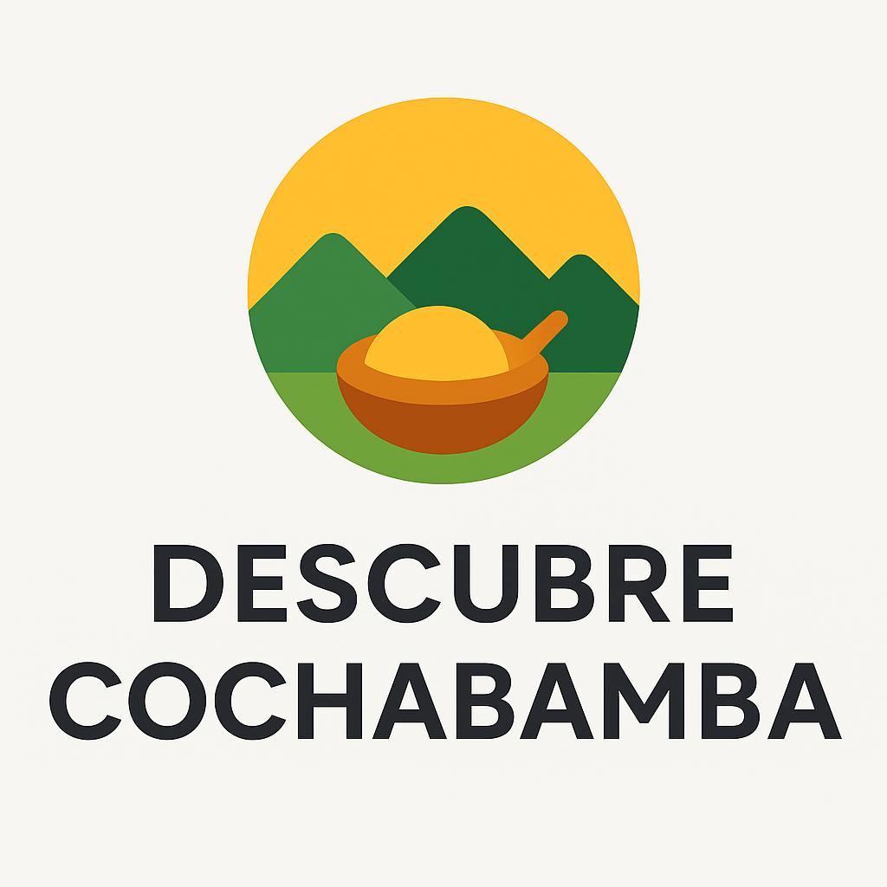

# **Layout del Sitio Web – Descubre Cochabamba**


## **1. Logotipo**

**Concepto:**

* Representa el **corazón de Bolivia** y la diversidad de Cochabamba.
* Elementos:

  * Montañas (Cordillera de los Andes)
  * Sol o cielo despejado (clima y naturaleza)
  * Icono de comida típica (plato o utensilio)
* Estilo: **moderno, minimalista, con colores vivos**.
* Tipografía del logotipo: **amigable y legible**, similar a “Poppins” o “Montserrat”.

---

## **2. Mapa de navegación (Site Map)**

Organización clara y jerárquica de las secciones:

```
Inicio
│
├─ Destinos
│   ├─ Naturaleza
│   ├─ Histórico
│   ├─ Aventura
│   └─ Cultural
│
├─ Gastronomía
│   ├─ Platos Típicos
│   ├─ Restaurantes Recomendados
│   └─ Recetas / Videos
│
├─ Cultura y Eventos
│   ├─ Festivales
│   ├─ Ferias
│   └─ Tradiciones
│
├─ Mapas Interactivos
│
├─ Galería Multimedia
│   ├─ Fotos
│   └─ Videos
│
└─ Contacto
    ├─ Formulario
    └─ Redes Sociales
```

---

## **3. Paleta de Colores**

Inspirada en la **naturaleza y cultura de Cochabamba**:

| Color | Muestra | Código HEX | Uso sugerido |
| :--- | :--- | :--- | :--- |
| **Verde Andino** | 🟢 | `#2E7D32` | Botones principales, íconos |
| **Amarillo Sol** | 🟡 | `#FBC02D` | Destacados, resaltados, hover |
| **Azul Cielo** | 🔵 | `#0288D1` | Fondos secciones, enlaces |
| **Naranja Tierra** | 🟠 | `#F57C00` | Llamadas a la acción, botones secundarios |
| **Blanco** | ⚪ | `#FFFFFF` | Fondo general y textos principales |
| **Gris Oscuro** | ⚫ | `#424242` | Textos secundarios, footer |
---

## **4. Tipografía**

Selección de tipografías **legibles y modernas**, con jerarquía clara:

| Elemento                   | Fuente sugerida | Estilo/uso               |
| -------------------------- | --------------- | ------------------------ |
| Títulos / Encabezados      | Montserrat      | Negrita, tamaños grandes |
| Subtítulos / Secciones     | Poppins         | Semi-bold                |
| Texto principal / párrafos | Roboto          | Regular, tamaño 16px     |
| Botones / CTA              | Montserrat      | Bold, mayúsculas         |

